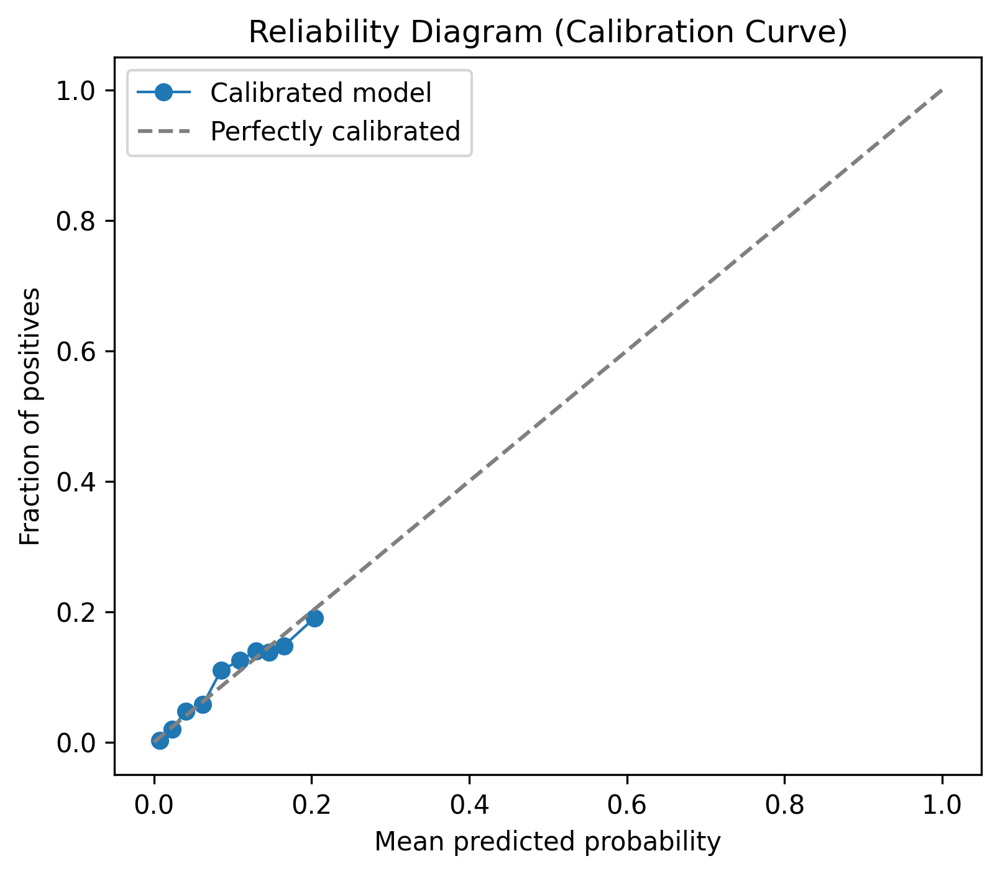
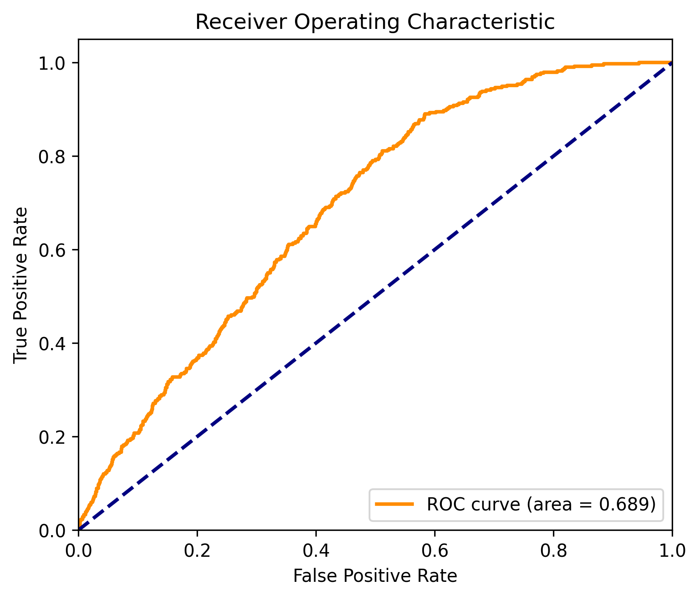
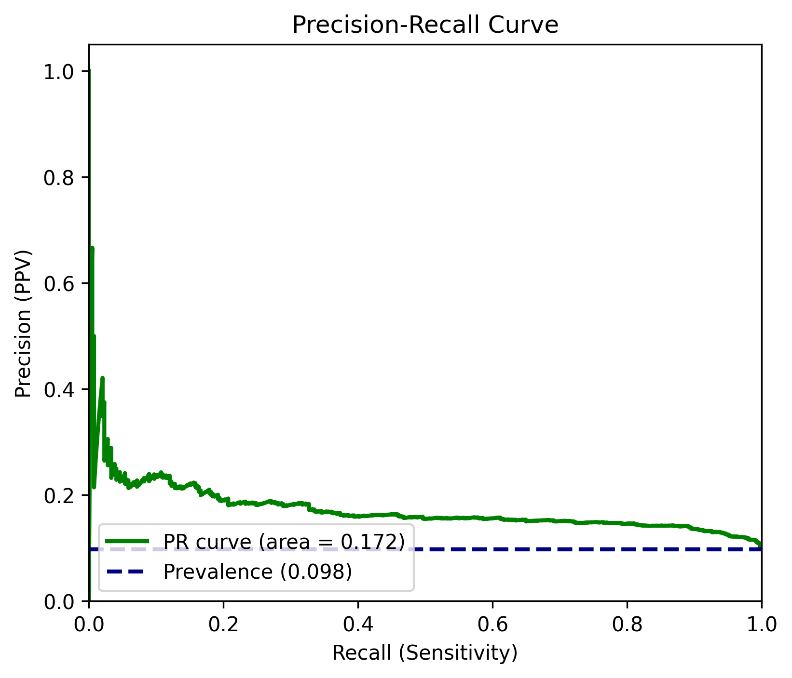

# MediPilot — Data & ML Engine
### Contribution by **Aditya Onam** · Branch: `feat/aditya-onam/data-ml`

---

> This module is the **core intelligence layer** of MediPilot — a real-time emergency triage risk scoring system. It handles everything from synthetic data generation and feature engineering to model training, calibration, conformal prediction, and a live FastAPI inference backend.

---

## Directory Structure

```
medipilot-model/
│
├── 📂 model/                        # Core ML pipeline
│   ├── train.py                     # Main training script (HistGBDT / XGBoost)
│   ├── train_seq.py                 # Sequence model training (GRU, TCN, Transformer)
│   ├── features.py                  # Feature extraction from PatientRecord
│   ├── feature_registry.py          # Feature versioning and metadata registry
│   ├── risk_model.py                # Inference wrapper — score_patient()
│   ├── predictor.py                 # Artifact loader + predict_p_critical()
│   ├── artifact.py                  # Artifact directory management
│   ├── calibration.py               # Isotonic regression per age stratum
│   ├── conformal.py                 # Mondrian conformal prediction (coverage guarantees)
│   ├── thresholds.py                # Cost-sensitive threshold solving
│   ├── evaluate.py                  # Full evaluation harness (8 go-live gates)
│   ├── leaderboard.py               # Multi-model comparison leaderboard
│   ├── age_stratum.py               # Age stratification logic (neonate/paed/adult/elder)
│   ├── reliability.py               # Reliability weighting for sensor source trust
│   ├── freshness.py                 # Vital freshness / staleness detection
│   ├── sequence_data.py             # Sequence tensorization for deep learning models
│   └── sequence_models.py           # PyTorch architectures (LastObs, GRU, TCN, Transformer)
│
├── 📂 data/                         # Data pipeline
│   ├── validate.py                  # Schema validation for training records
│   ├── report_stratum_n.py          # Stratum distribution reporting
│   ├── train_set.meta.json          # Metadata for the 100k training set
│   └── generator/
│       ├── bulk.py                  # Bulk synthetic patient record generation
│       ├── corpus.py                # Clinical vignette corpus definitions
│       ├── conditions.py            # Condition-specific vital sign distributions
│       ├── labels.py                # Ground-truth label generation logic
│       ├── missingness.py           # Realistic data missingness injection
│       └── trajectories.py         # Longitudinal vital sign trajectory simulation
│
├── 📂 backend/                      # FastAPI inference & orchestration backend
│   ├── api.py                       # REST API — /score, /override, /recheck, /queue
│   ├── band_engine.py               # Asymmetric autonomy band assignment (Invariant 1)
│   ├── audit_log.py                 # Cryptographic audit chain for all decisions
│   ├── narrative.py                 # Ollama LLM narrative layer (interpretability only)
│   ├── recheck_scheduler.py         # Two-clock re-score and re-measurement scheduler
│   └── surge_controller.py          # Surge detection and cadence escalation policy
│
├── 📂 rules/                        # Hard-coded clinical safety rules
│   ├── red_flag_engine.py           # Red-flag override rules (SpO2, HR extremes, etc.)
│   ├── spo2_bias_guard.py           # SpO2 de-escalation bias guard
│   └── vital_thresholds.py          # Age-stratified vital sign threshold tables
│
├── 📂 config/                       # System configuration (YAML)
│   ├── age_strata.yaml              # Age stratum boundary definitions
│   ├── band_cadence.yaml            # Re-measurement cadences per triage band
│   ├── feature_registry.yaml        # Feature versioning manifest
│   ├── label_spec.yaml              # Label definition and outcome mapping
│   ├── red_flags.yaml               # Red flag condition definitions
│   └── surge_policy.yaml            # Surge threshold and escalation policy
│
├── 📂 tests/                        # Comprehensive test suite (pytest)
│   ├── test_age_stratification.py   # Age stratum boundary tests
│   ├── test_audit_log.py            # Audit chain integrity tests
│   ├── test_band_engine.py          # Asymmetric autonomy enforcement tests
│   ├── test_corpus_cases.py         # Clinical vignette correctness tests
│   ├── test_features.py             # Feature extraction regression tests
│   ├── test_invariants.py           # All 9 system invariant tests
│   ├── test_model_training.py       # Training pipeline smoke tests
│   ├── test_reliability_weighting.py# Sensor trust weighting tests
│   └── test_surge_controller.py     # Surge detection logic tests
│
├── RISK_ENGINE.md                # Full technical specification (8 go-live gates)
├── MODEL_EXPANSION_PLAN.md       # Roadmap: sequence models, LLM integration
├── FIX_PLAN.md                   # Known issues and resolution tracker
├── requirements.txt              # Core Python dependencies
├── requirements-experimental.txt # PyTorch / deep learning dependencies
├── run_bakeoff.py                # Multi-model bake-off runner
├── plot_results.py               # ROC/PR/calibration curve plotting
├── train_seq_all.bat             # Windows batch script — train all sequence models
├── pytest.ini                    # Test runner configuration
└── conftest.py                   # Shared pytest fixtures
```

---

## System Architecture

```
┌─────────────────────────────────────────────────────────────────┐
│                       MediPilot ML Engine                        │
│                                                                   │
│  ┌──────────────┐    ┌──────────────┐    ┌────────────────────┐  │
│  │  Synthetic   │    │   Feature    │    │   Risk Scoring     │  │
│  │  Data Gen    │───▶│  Extraction  │───▶│   Engine (GBDT)    │  │
│  │  (100k recs) │    │  (35 feats)  │    │   + Calibration    │  │
│  └──────────────┘    └──────────────┘    └────────────────────┘  │
│                                                    │              │
│  ┌──────────────┐    ┌──────────────┐    ┌────────▼───────────┐  │
│  │   Conformal  │    │  Isotonic    │    │   Band Assignment  │  │
│  │  Prediction  │◀───│  Calibration │◀───│  Red/Yellow/Green  │  │
│  │  (coverage)  │    │  per stratum │    │   + Cost Ratio R   │  │
│  └──────────────┘    └──────────────┘    └────────────────────┘  │
│                                                    │              │
│  ┌──────────────────────────────────────┐ ┌───────▼────────────┐  │
│  │          FastAPI Backend             │ │  Audit Chain       │  │
│  │  /score  /override  /recheck /queue  │ │  (tamper-evident)  │  │
│  └──────────────────────────────────────┘ └────────────────────┘  │
└─────────────────────────────────────────────────────────────────┘
```

---

## Model Pipeline — Step by Step

### 1. Data Generation
Synthetic patient records are generated using `data/generator/` — a modular pipeline that simulates realistic vital sign trajectories, condition-specific distributions, and realistic missingness patterns.

```bash
python -m data.generator.bulk --n 100000 --out data/train_set_100k.jsonl
```

### 2. Feature Engineering
`model/features.py` extracts **35 clinical features** from each `PatientRecord`:
- Raw vitals: HR, RR, BP, SpO2, Temp, GCS, Pain
- Derived: shock index, tachycardia flag, hypoxia severity, age z-score
- Temporal: vital trend slopes, inter-reading deltas, staleness flags
- Reliability: source trust weights per vital (station > nurse > self-report)
- Auxiliary: derangement OOF score from auxiliary head

### 3. Training — Tabular Models
```bash
python -m model.train --data data/train_set_100k.jsonl --seed 1337
```
Trains a **HistGradientBoosting** primary classifier with:
- Stratified 60/10/10/20 train/isotonic/conformal/test split
- 5-fold OOF auxiliary head
- Per-stratum isotonic calibration
- Mondrian conformal quantile fitting
- Cost-sensitive threshold solving with configurable cost ratio R

### 4. Training — Sequence Models
```bash
# Train all architectures in a single data-load pass
train_seq_all.bat
# or directly:
python -m model.train_seq --models all
```
Sequence architectures trained on padded (100k × 37 timesteps × 14 features) tensors:
| Model | Architecture | Notes |
|---|---|---|
| `last-obs` | Last-observation baseline | No temporal learning |
| `gru` | Gated Recurrent Unit | Captures temporal trends |
| `tcn` | Temporal Convolutional Network | Parallelisable, fixed receptive field |
| `transformer` | Multi-head Self-Attention | Full-sequence attention |

### 5. Calibration
Per-stratum isotonic regression maps raw model probabilities → calibrated probabilities:
- Strata: `neonate`, `paediatric`, `adult`, `elder`
- Calibration slope target: 0.85 – 1.15 (Gate 6)

### 6. Conformal Prediction
Mondrian conformal prediction provides **marginal coverage guarantees** at α = 0.10:
- Coverage target ≥ 90% per stratum (Gate 7)
- Non-conformity scores fitted on a held-out conformal set

### 7. Threshold Solving
Cost-sensitive thresholds balance false negatives vs. false positives with configurable cost ratio **R**:
- R = 2.0 (default): missing a critical patient costs 2× vs. a false alarm
- Dynamically adjustable via `PUT /cost-ratio` API endpoint

---

## 8 Go-Live Gates

Every model must pass all 8 gates before it is eligible to replace the deployed model:

| Gate | Metric | Threshold |
|---|---|---|
| G1 | AUPRC ≥ baseline (HistGBDT-20k) | Strict improvement |
| G2 | AUROC ≥ 0.70 | Discrimination floor |
| G3 | Oracle recall ≥ 40% | Clinical sensitivity |
| G4 | Grade miss rate < 0.12 | Band accuracy |
| G5 | FNR on critical ≤ 0.10 | Safety floor |
| G6 | Calibration slope 0.85–1.15 | Reliability |
| G7 | Conformal coverage ≥ 0.90 | Guarantee |
| G8 | No stratum with N < 50 | Statistical validity |

---

## Safety Invariants

The system enforces **9 hard invariants** that cannot be overridden by code:

1. **Asymmetric Autonomy** — The model may raise a band but NEVER lower one without a human override record
2. **Never Partial** — Every scoring call returns a complete ScoreObject or AbstentionObject — never partially filled
3. **Audit Completeness** — Every override is written to the tamper-evident audit chain before the response is returned
4. **SpO2 Bias Guard** — SpO2-alone de-escalation is blocked for high skin-tone bias risk patients
5. **Conformal Coverage** — Prediction sets always contain the true label with ≥90% marginal coverage
6. **Calibration Bound** — Deployed model calibration slope stays within [0.85, 1.15]
7. **Surge Cadence Lock** — Under surge, re-measurement cadences can only shorten, never lengthen
8. **OOD Abstention** — Out-of-distribution inputs trigger abstention, not a silent band assignment
9. **Feature Version Lock** — Model artifact and feature extractor versions must match at inference time

---

## Quickstart

### Prerequisites
```bash
pip install -r requirements.txt
# For sequence models (PyTorch):
pip install -r requirements-experimental.txt
```

### Run the API Server
```bash
python -m backend.api
# Server starts at http://localhost:8000
# Swagger UI at http://localhost:8000/docs
```

### Score a Patient
```bash
curl -X POST http://localhost:8000/score \
  -H "Content-Type: application/json" \
  -d '{
    "patient_id": "PT-001",
    "age_days": 16425,
    "age_known": true,
    "hr": {"value": 118, "timestamp": "2024-01-01T10:00:00Z", "source": "nurse", "validity": "valid"},
    "rr": {"value": 24, "timestamp": "2024-01-01T10:00:00Z", "source": "nurse", "validity": "valid"},
    "bp_sys": {"value": 88, "timestamp": "2024-01-01T10:00:00Z", "source": "nurse", "validity": "valid"},
    "spo2": {"value": 93, "timestamp": "2024-01-01T10:00:00Z", "source": "nurse", "validity": "valid"}
  }'
```

### Run All Tests
```bash
pytest tests/ -v
```

### Generate the Leaderboard
```bash
python -m model.leaderboard --artifacts model/artifacts/medipilot-gbdt-v0.2.0 model/artifacts/medipilot-hist-100k-s1337
```

---

## Current Model Leaderboard

| Model | Dataset | AUPRC | AUROC | Gates |
|---|---|---|---|---|
| `hist-100k` | 100,000 records | **0.1805** | **0.7123** | 8/8 |
| `hist-20k` | 20,000 records | 0.1740 | 0.6894 | 8/8 |
| `gbdt-v0.2.0` (baseline) | 20,000 records | 0.1640 | 0.6710 | 8/8 |

> **Current shipped model:** `medipilot-hist-100k-s1337`

---

## Model Performance & Validation

Our primary models are rigorously evaluated against strict safety and clinical efficacy standards. Below are the core validation curves for the deployed `medipilot-hist-100k-s1337` model:

### 1. Calibration Curve (Isotonic Regression)
Proper probability calibration is critical for safe triage. The isotonic regression step maps raw probabilities to true clinical risks.



### 2. ROC Curve
The Receiver Operating Characteristic demonstrates discrimination power across all thresholds.



### 3. Precision-Recall Curve
Due to class imbalance in emergency medicine, the PR curve highlights our model's performance on the rare but critical positive class.



---

## API Reference

| Method | Endpoint | Description |
|---|---|---|
| `POST` | `/score` | Score a patient → returns Red/Yellow/Green band |
| `POST` | `/override` | Clinician override with mandatory reason text |
| `POST` | `/recheck/{patient_id}` | Mark physical re-measurement as complete |
| `GET` | `/surge-status` | Current surge mode and active cadence policy |
| `GET` | `/audit/{patient_id}` | Full tamper-evident audit chain for a patient |
| `PUT` | `/cost-ratio` | Update cost ratio R (1.0–5.0) — live threshold shift |
| `POST` | `/demo/arrival` | Simulate patient arrival for surge demo |

---

## Output: ScoreObject

```json
{
  "patient_id": "PT-001",
  "band": "red",
  "confidence": 0.847,
  "confidence_reason": "high_risk_vitals",
  "abstained": false,
  "score_source": "ml_model",
  "model_version": "hist-100k-s1337",
  "calibration_version": "isotonic-v3",
  "conformal_lower": 0.781,
  "conformal_upper": 0.923,
  "factors_for": ["tachycardia", "hypotension", "hypoxia"],
  "factors_against": [],
  "inputs_hash": "sha256:...",
  "scored_at": "2024-01-01T10:00:05Z"
}
```

---

## Contributor

| Name | Role | Scope |
|---|---|---|
| **Aditya Onam** | Data & ML Lead | Synthetic data generation · Feature engineering · Model training & calibration · Conformal prediction · Backend API · Safety invariants · Evaluation harness |

---

## License
MIT License — See root `LICENSE` file.
