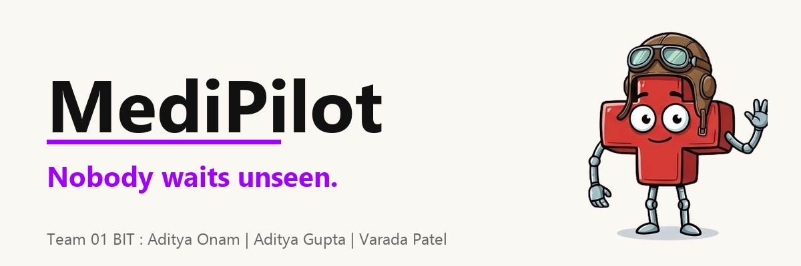

# MediPilot — PatientTriage.ai

**Team 01 BIT · IIT Patna · Accenture Innovation Challenge 2026, Round 2**
Aditya Onam · Aditya Gupta · Varada Patel

> **All data in this repository is synthetic.** We make no clinical claim, no performance claim against Indian patients, and no causal claim about outcomes. `SIMULATED DATA` is on every screen.

🎥 **[Prototype Demo Video](https://youtu.be/6aCak3KNSOI)**

## Abstract

This is the implementation repository for the MediPilot prototype: what was built, how the tree is arranged, what it runs on, how its data is manufactured, and how the model is evaluated.

The system is built on a strict clinical contract: **the system may raise a waiting patient's priority autonomously and may never lower it below a human-assigned level.**

To enforce this, the architecture is split into three tracks that cannot borrow each other's authority: a perception track that may only *report* (ASR/LLM), an interface track that may only *render* (Next.js), and an evaluation track that alone may *decide* (Python Orchestrator). Every model in the system has a deterministic layer beneath it, ensuring that a missing API key or an absent GPU degrades the demonstration rather than stopping it.

---

## The one idea

Most triage demos show a language model producing an acuity level. This one shows a language model
that **structurally cannot**.

```
   the model reports what was said
              ↓
   a fixed table decides what it means
              ↓
   the band engine assigns, and can only escalate
```

Everything else — the two clocks, the six age strata, the conformal sets, the abstention gate —
exists to make that split survive contact with a real department.

### The six invariants

Each one is a test that fails the build, not a line in a review checklist.

| # | Invariant | Where it is enforced |
|---|---|---|
| **1** | **Asymmetric autonomy.** The system may raise a band on its own. It may never lower one below a human-assigned band. | `band_engine.py` raises `AsymmetricAutonomyViolation`; the frontend has no downward code path, and `/control` reports `moved.down` as structurally 0 |
| **2** | **No naked scores.** Every risk value carries a confidence indicator and the inputs it used. | `AcuityCard` *throws* in dev without `confidence` / `conformalSet` / `inputsUsed` |
| **3** | **Age is never assumed.** No threshold applies before a stratum resolves; unknown age uses the widest-safety stratum and says so. | `VitalChip` refuses to render a band comparison without a resolved stratum |
| **4** | **Freshness is part of the value.** A measurement is `{value, takenAt, source, validity}`. Past 3× cadence it renders as **missing**, not as a stale number. | `world.py` computes validity server-side |
| **5** | **Abstention is loud, and never Green.** | `AbstentionCard` makes GREEN unrepresentable in the type, with a runtime guard behind it |
| **6** | **The human closes every loop.** Override is one touch from every surface where a band is shown. | `OverrideDialog`, and a 16-field record rendered verbatim on `/audit` |

---

## What is built, and what is not

Stated plainly, because saying it out loud is a strength.

| Built and demonstrated | Described, not built |
|---|---|
| Band engine with cost-sensitive threshold and the live **R** control | Federated learning across sites |
| Two-clock recheck scheduler with wait ceilings and breach escalation | Real HIS / FHIR / CDS Hooks integration |
| Age stratification across all six strata | Live ABHA record retrieval |
| Conformal sets, OOD gate, abstention | Ambient camera and microphone sensing |
| Red-flag pass over structured narrative | Mass-casualty mode |
| Talking, branching patient intake in Hindi + English | Multi-site calibration |
| Nurse card, board, counter, override capture, audit ledger | Production edge deployment |
| Surge controller at 3× | Self-supervised pretraining at scale |
| Synthetic generator and the 20-record corpus | — |

Nothing from the right column has a screen.

---

## Quick start

Two processes. The frontend runs the whole demo **without** the backend, on a seeded mock adapter —
that is deliberate insurance, not a shortcut.

### Frontend

```bash
cd web
npm install
npm run dev
```

`http://localhost:3000` — seven surfaces, all working on mock data.

```bash
cp .env.example .env.local
```

| Variable | Default | Notes |
|---|---|---|
| `NEXT_PUBLIC_MP_SOURCE` | `mock` | `live` switches to the Python orchestrator |
| `NEXT_PUBLIC_API_BASE` | `http://localhost:8000(local deployment, currently deployed on Google Clound)` | only read when `live` |
| `GROQ_API_KEY` | *(unset)* | **server-only, no `NEXT_PUBLIC_` prefix.** `/intake` works fully without it |
| `MEDIPILOT_INTAKE_OFFLINE` | *(unset)* | `1` forces the offline path, for rehearsing without burning free-tier quota |

### Backend

```bash
cd backend
pip install -r requirements.txt
uvicorn triage.orchestrator.app:app --reload --port 8000
```

```bash
pytest            # tests/ + intake/
```

Then set `NEXT_PUBLIC_MP_SOURCE=live` and restart the frontend.

**Chrome only for voice.** Speech recognition is `webkitSpeechRecognition`, which Firefox and
Safari do not implement. Every question is answerable by tapping or typing, so a different browser
or a denied microphone degrades the experience rather than blocking it.

---

## The seven surfaces

| Route | Surface | Theme | Mascot |
|---|---|---|---|
| `/` | Launcher and project showcase | Dark | Yes |
| `/intake` | Patient kiosk — the talking, branching triage conversation | Warm paper | Yes |
| `/counter` | Vitals station — enter the readings intake asked for | Dark | No |
| `/board` | Nurse board — the queue, three time facts per card, breaches | Dark | No |
| `/card/[id]` | The nurse card — three explainability channels, accept / override / discharge | Dark | No |
| `/control` | Judge-facing panel — **R**, surge, simulation clock | Dark | No |
| `/audit` | Override records rendered verbatim, hash-chained ledger | Dark | No |
| `/hall` | Public waiting display — **token numbers only** | Light | Ambient |

**The mascot law.** MediPilot is a *pilot*, not a nurse. It is permitted on patient surfaces and
**banned from every clinical decision surface** — enforced by a runtime throw in
`components/mascot/Mascot.tsx`, not by memory.

**The hall board is defined by what it refuses to display.** No names, no acuity, no colour a
waiting family could decode. That constraint is a feature.

---

## `/intake` — the part that talks

A self-contained module at `web/intake/`. It opens with *"tell me what's wrong"*, classifies
the answer into one of **16 clinical branches**, and asks 3–6 branch questions plus a universal
tail — dropping any question the patient already answered on their own.

**Answering runs in three tiers, and Groq is the exception path:**

| Tier | What | Cost |
|---|---|---|
| 0 | Exact lexicon — yes/no and 0–10, in English, Devanagari and romanised Hinglish | instant, offline |
| 1 | Similarity over labels, value slugs and per-option `synonyms`, plus an edit-distance rescue for ASR near-misses | instant, offline |
| 2 | `/api/intake/match` — the model picks one of the given option values, or `NONE` | network, rarely reached |

The tier-2 output vocabulary is **closed by construction**: anything returned that is not one of
the offered option values reads as `NONE`. The model cannot invent an option, and it is never asked
what an answer means clinically.

**Red flags run continuously, in two tiers.** Tier A is a bilingual phrase table over the eight
codes in `config/red_flags.yaml` — deterministic, offline, and therefore never delayed by wifi.
Tier B asks a model for a subset of that same closed eight-code list and nothing else. When one
fires, every clinical question stops, a nurse is called, and **no acuity word appears anywhere on
the patient's screen**.

Adding a question is a row edit in `intake/tree/branches/*`, never a component edit. That is what
lets *"what about dialysis patients?"* be answered on stage by pointing at a file.

---

## Measured numbers

Real, from our own bake-offs in `backend/eval/`.

**LLM structurer** — 10 candidates, on adversarial / Hinglish / negation / paediatric / obstetric
splits:

| Candidate | Symptom F1 | Red flags missed | Schema failures |
|---|---|---|---|
| `groq:openai/gpt-oss-120b` | **0.962** | **0** | 0 |
| `groq:openai/gpt-oss-20b` | 0.816 | 4 | 4 |
| `local:Qwen2.5-3B-Instruct` | 0.650 | 8 | 0 |
| RuleBasedStructurer *(not an LLM)* | 0.510 | 12 | 0 |

**ASR** — `groq:whisper-large-v3-turbo`, WER 0.000 on the test set, 0.298 s mean latency, zero
silence hallucinations.

Note the deterministic rule-based row: it is the floor the system falls back to, and it is
explicitly labelled as not an LLM so the demo can never claim extraction it did not perform.

---

## The two clocks

The largest correction between Round 1 and Round 2, and the difference between "we re-score every
five minutes" and a defensible resource model.

- **Re-scoring** is the model running again. Milliseconds. Never rationed.
- **Re-measurement** is a human physically taking fresh vitals. The scarcest thing in the
  department. Rationed by band.
- **The wait ceiling** is a third, independent trigger: time in queue alone forces action.

| Band | Re-score | Re-measure | Ceiling | On breach |
|---|---|---|---|---|
| Red | 60 s | 5 min | 0 min | Any Red still queued at 5 min pages the senior clinician |
| Yellow | 5 min | 30 min | 60 min | Forced re-measurement; not done in 15 min → escalates to Red **on time alone** |
| Green | 5 min | 60 min | 120 min | Forced re-measurement + wellbeing contact |
| Abstained | 5 min | on review | 15 min | Unmet-review breach; holds at the Yellow floor |

Every queue card carries all three as separate facts. Under 3× surge, Yellow stretches to 45 min
and Green to 90 — **Red never stretches**, and the UI shows the three relaxations the system
refuses to make.

---

## Repository layout

Paths ignored by `.gitignore` are omitted — planning documents, the media library,
virtualenvs, build output, generated training data and bake-off result dumps.

```
.
├── README.md
├── MediPilot-Pixel-Triage-Reel.md      Production shot list for the demo film
│
├── web/                                 Next.js 16 · React 19 · Tailwind 4
│   ├── app/
│   │   ├── page.tsx  layout.tsx  globals.css
│   │   ├── intake/       counter/     board/      hall/
│   │   ├── card/[id]/    control/     audit/
│   │   ├── api/intake/                 Server-only Groq routes
│   │   │   ├── classify/  match/  observe/  selftest/
│   │   └── _intake-old/                Parked, unrouted. Delete after the demo
│   │
│   ├── intake/                          THE TALKING TRIAGE MODULE
│   │   ├── IntakeApp.tsx  session.ts  strings.ts  README.md
│   │   ├── tree/                        Question data — no React
│   │   │   ├── types.ts  engine.ts  index.ts  tail.ts  ageStratum.ts
│   │   │   ├── localClassify.ts  classifyRemote.ts
│   │   │   └── branches/                16 clinical branches
│   │   │       ├── chestPain.ts  breathing.ts   abdominal.ts  neuro.ts
│   │   │       ├── fever.ts      trauma.ts      bleeding.ts   gi.ts
│   │   │       ├── obstetric.ts  poisoning.ts   burn.ts       allergy.ts
│   │   │       └── urinary.ts    mental.ts      paedsGeneral.ts  other.ts
│   │   ├── voice/                       useSpeech · vad · tts · languages
│   │   ├── match/                       The three tiers
│   │   ├── redflags/                    The 8 codes + offline detector
│   │   ├── server/                      groq · prompts · validate (server-only)
│   │   └── components/                  Screen · MicOrb · QuestionCard · steps/
│   │
│   ├── components/
│   │   ├── clinical/                    AcuityCard  AbstentionCard  BandChip
│   │   │                                CadenceStrip  ConfidenceBand  QueueCard
│   │   │                                ExplanationChannels  LockedAcuitySlot
│   │   │                                OverrideDialog  RedFlagBanner
│   │   │                                VitalChip  VitalEntryDialog  VitalIcon
│   │   ├── mascot/                      Guarded — throws on clinical routes
│   │   ├── 3d/                          MascotScene · KioskScene
│   │   └── ui/
│   │
│   ├── lib/
│   │   ├── api/                         THE CONTRACT
│   │   │   ├── types.ts                 Shared verbatim with the backend
│   │   │   ├── client.ts                Adapter selector
│   │   │   └── adapters/  mock.ts · live.ts
│   │   ├── clinical/                    ageBands · safeWait · vitals
│   │   │                                riskEngine · redFlags
│   │   ├── seed/                        corpus.ts (P-01…P-20) · surgeFillers
│   │   ├── intake/  hooks/  voice/
│   │   └── ...
│   │
│   ├── public/media/                    Mascot poses, cutouts, videos, textures
│   │
│   ├── BACKEND_INTEGRATION_LOG.md       The API contract, v0.2
│   ├── IMPLEMENTATION_LOG.md            Session-by-session record
│   ├── IMPLEMENTATION_LOG_FRONTEND.md
│   └── package.json  tsconfig.json  next.config.ts  eslint.config.mjs
│
├── backend/
│   ├── triage/
│   │   ├── orchestrator/        app.py · world.py · clock.py · dto.py
│   │   │                        seed.py · mapping.py · tree_session.py
│   │   │                        option_matcher.py · speech_intake.py
│   │   ├── band_engine.py       Invariant 1 lives here
│   │   ├── audit_log.py         Append-only, SHA-256 chained
│   │   └── recheck_scheduler.py surge_controller.py narrative.py api.py
│   │
│   ├── intake/                  M03–M09 · state machine, question tree,
│   │                            LLM structurer, red flags, reliability,
│   │                            age stratification (+ 6 test modules)
│   ├── speech/                  M05 · faster-whisper, Groq ASR, VAD
│   ├── model/                   Features, calibration, conformal,
│   │                            thresholds, training, artifacts/
│   ├── rules/                   red_flag_engine · vital_thresholds
│   │                            spo2_bias_guard
│   ├── data/                    generator/ + corpus_20.json
│   ├── eval/                    ASR and structurer bake-offs (+ Kaggle)
│   ├── config/                  age_strata · band_cadence · red_flags
│   │                            surge_policy · feature_registry · label_spec
│   ├── tests/                   invariants · band engine · audit ·
│   │                            age stratification · orchestrator contract
│   └── requirements.txt  pytest.ini  conftest.py
│
├── docs/                        Whitepaper, implementation logs, metrics
│   ├── paper/                   LaTeX whitepaper source
│   ├── diagrams/                Architecture diagrams (SVG + PNG)
│   └── benchmarks/              ASR and structurer bake-off tables
```

**Everything crosses one boundary.** No page talks to the backend except through
`lib/api/client.ts`. One environment variable switches `mock` for `live`, and no UI code changes.

---

## The demonstration corpus

Twenty synthetic records at `lib/seed/corpus.ts` and `data/corpus_20.json`, joined on `case_id`.
Each exists to make exactly one behaviour visible — do not invent new ones.

| ID | Presentation | Demonstrates |
|---|---|---|
| P-01 | Crushing chest pain, diaphoretic | Red-flag pass fires **before** the model returns |
| P-02 | Minor laceration | Green that stays Green. The negative control |
| P-03 / P-04 | 3-year-old and 75-year-old, **both 38.5 °C** | Age stratification. Same number, different meaning |
| P-05 | Mild chest discomfort, Yellow at arrival | **The hero case.** Escalates autonomously at minute 18 |
| P-07 | Epigastric pain — gastritis or inferior MI | Ambiguous presentation *(submission gate)* |
| P-08 | SpO₂ reads 96 %, patient distressed | Pulse-oximeter bias. Normal reading carries **no de-escalation authority** |
| P-09 | Vitals three hours old | Freshness contract. Same numbers, decayed confidence |
| P-11 | First visit, no record, no ABHA link | Zero-history patient *(submission gate)* |
| P-14 | Yellow; nurse finds a rigid abdomen | Clinician override, full 16-field record *(submission gate)* |
| P-15 | Unlike anything in the local distribution | OOD gate. Abstains out loud, holds at Yellow |
| P-17 | Declines to share medical history | Consent gate. Triaged **without penalty** |
| P-18 | Active labour | Red flag on **narrative alone**; vitals unremarkable |
| P-20 | Green, two rechecks missed under load | Wait-ceiling breach escalates on time alone |

*(P-06, P-10, P-12, P-13, P-16, P-19 cover atypical sepsis, sensor loss, rich prior history,
communication barrier, inferred stratum, and stoic presentation.)*

### The 100k Training Corpus
The full dataset used to train and calibrate the risk engine is available as a compressed archive: `backend/data/train_set_100k.zip`. It contains 100,000 synthetically generated patient encounters, fully preserving the strict clinical dependencies and age stratification logic outlined above.

---

## Where the models run

Three tiers, in preference order. `GET /v1/config` reports which one is actually serving, so the
demo can never claim local inference it is not performing.

| Tier | Speech | Structurer | Patient data leaves the machine? |
|---|---|---|---|
| **1 · Local** | `faster-whisper` (CTranslate2, int8) | Ollama / llama.cpp | **No** |
| **2 · Hosted free tier** | Groq `whisper-large-v3-turbo` | Groq, schema-constrained | Yes |
| **3 · Floor** | *none — returns 503* | `RuleBasedStructurer` — keywords, not an LLM | No |

There is deliberately **no paid cloud GPU tier**. Under India's DPDP Act 2023 raw patient data
stays at the institution; the hosted tier is prototype-grade convenience, and the architecture is
built so it never becomes necessary. As an alternative to the API, an 8GB self-hosted LLM (e.g. running via Ollama/llama.cpp) can be used completely offline. `dataLeavesMachine` is the field to point at on stage.

---

## Verification

```bash
cd web  && npx tsc --noEmit && npm run build
cd backend && pytest
curl -s localhost:3000/api/intake/selftest     # 118 intake fixtures, dev only
```

The intake self-test covers tier 0/1 matching across English, Devanagari, romanised Hindi and ASR
near-misses; the red-flag phrase table including the compound RF-03 rule and a negation set
(*"no chest pain at all"* must not fire); adversarial model responses; every inverted `observeOn`
question driven in both directions; and a coverage check that every branch has ≥3 questions and at
least one route to a nurse.

---

## Known gaps

Stated rather than discovered.

1. `POST /v1/encounter/{id}/vitals` and `POST /v1/encounter/{id}/disposition` exist in the mock
   adapter only. **`/counter` and the discharge flow are mock-only until those land.**
2. `/v1/intake/submit` does not yet return `requiredVitals`, so the token screen's
   "here is what will happen to you" is mock-only.
3. Two intake implementations are in the tree at once. The old one is underscore-parked and
   unrouted, and nothing new imports it. Delete after the demo.

---

## Where this sits on the ladder

| Rung | Runs on | Gate to the next |
|---|---|---|
| **Prototype ← we are here** | Synthetic only | A partner hospital agrees to a retrospective export |
| V1 | One site, retrospective | Shadow-mode agreement and ethics clearance |
| V2 | One site, shadow mode | ECE < 0.05 across every stratum and subgroup |
| V3 | One site, live, supervised | Trial results hold; CDSCO pathway confirmed |
| V4–V5 | Multi-site, then federated | — |

Naming the ladder is what lets us say plainly what the prototype does **not** establish, while
showing that we know exactly what each of those would require.

---

**Jurisdiction assumed:** India — DPDP Act 2023, CDSCO SaMD Class B/C, ICMR 2023 ethics guidance,
ABDM/ABHA for record linkage. **Severity scale:** 3-tier AIIMS ATP, with an internal five-point
mapping so the system can export to ESI-speaking hospitals without retraining.
